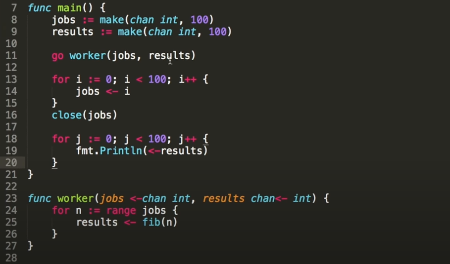

#Concurrency

##goroutine

The program will execute the line 9, but it will never reach to line 10.

It will print "sheep" forever.

-------

If we put the keyword "go" on the line 9, it will continue to execute the line 10. This creates a "goroutine" 

Here, if we have 2 goroutines.
 - main goroutine
 - goroutine on the line 9

This program prints something like:
 
  fish
  sheep
  fish 
  sheep 
  sheep
  fish

-------

This will print nothing.
Why?
When the main goroutine finishes, the program exits whether there is alive goroutine.

So, what should we do?

Use WaitGroup by importing "sync" group

---------------

WaitGroup is a counter
Using an anonymous function and execute it right after declaring it.

wg.Add(1)   increment
wg.Done()   decrement by 1
wg.Wait()   block until the count is 0

-----------------

##Channels

Channel is a way for goroutines to communicate.

Like a pipe, we should also decalre the type of "message"

channel <- thing //to send
dest <- channel //to receive
<- channel  //If want to discard the message

ONLY the sender must close the channel.

Sending and Receiving is blocking operations

When you receive something, you have to wait for a value/message to receive

 

This prints only 1 "sheep"

Here, in order to print all 5 "sheep", we are using for loop. But we get deadlock at the end. Why?

Because even *count* function is finished, the receiver is still waiting for a message on the channel.

To fix this, we should close the channel.

We can also use the second return value open and break from for loop. But, there is a better way using range

-----------

Will this work?
No. We are getting a deadlock.

Because the send will be blocked until something is ready to receive. But, the execution never reaches the line 11

How to make this work?

 * Using buffered channel by giving capacity

It won't block until the channel is full

--------------

##SELECT statement

Here instead of printing "Every 500ms" for each 500ms, it gets printed every 2 seconds, at the same time with "Every two seconds"

Why? We are blocking the slow one (line 28)

Here, we can use a select statement which allows us to receive from whichever channel is ready

This will print something like

Every 500ms
Every 500ms
Every 500ms
Every 500ms
Every two seconds
Every 500ms
Every 500ms
Every 500ms
Every 500ms
Every two seconds

----------

##Worker pools

 * Common pattern
 * A queue of work to be done and multiple concurrent workers pulling items off the queue.

jobs <-chan int  //Means jobs channel will only receive inside the function
results chan<- int //Means results channel will only send inside the function 

<-chan // read only
chan<- // write only

We can also add more "workers"